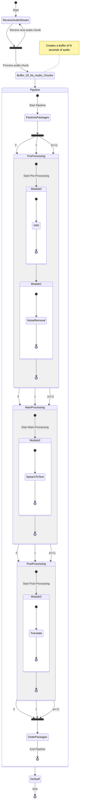

# Pipeline

```mermaid
stateDiagram-v2
    [*] --> ReceiveAudioStream: Start
    

    state audio_fork <<fork>>
    ReceiveAudioStream --> audio_fork
    audio_fork --> Buffer_Of_Ns_Audio_Chunks: Process audio chunk
    audio_fork --> ReceiveAudioStream: Receve next audio chunk

    Buffer_Of_Ns_Audio_Chunks --> Pipeline
    note left of Buffer_Of_Ns_Audio_Chunks
        Creates a buffer of N seconds of audio
    end note

    state Pipeline {
        [*] --> PackIntoPackages: Start Pipeline
        state parallelPipe <<fork>>
        PackIntoPackages --> parallelPipe
        parallelPipe --> PreProcessing: 0
        parallelPipe --> PreProcessing: 1
        parallelPipe --> PreProcessing: (n+1)
        
        state PreProcessing {

            [*] --> Module0: Start Pre-Processing

            state Module0 {
                [*] --> VAD
                VAD --> [*]
            }

            Module0 --> Module1

            state Module1 {
                [*] --> NoiseRemoval
                NoiseRemoval --> [*]
            }

            Module1 --> [*]
        }
        
        PreProcessing --> MainProcessing: 0
        PreProcessing --> MainProcessing: 1
        PreProcessing --> MainProcessing: (n+1)
        
        state MainProcessing {
            [*] --> Module2: Start Main-Processing
            state Module2 {
                [*] --> SpeachToText
                SpeachToText --> [*]
            }

            Module2 --> [*]
        }
        
        MainProcessing --> PostProcessing: 0
        MainProcessing --> PostProcessing: 1
        MainProcessing --> PostProcessing: (n+1)
        
        state PostProcessing {
            [*] --> Module3: Start Post-Processing
            state Module3 {
                [*] --> Translate
                Translate --> [*]
            }

            Module3 --> [*]
        }

        state parallelPipeJoin <<join>>
        PostProcessing --> parallelPipeJoin: 0
        PostProcessing --> parallelPipeJoin: 1
        PostProcessing --> parallelPipeJoin: (n+1)
        parallelPipeJoin --> OrderPackages
        OrderPackages --> [*]: End Pipeline
    }

    Pipeline --> DoStuff
    DoStuff --> [*]: End


```

