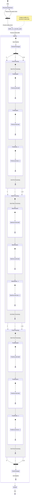

# Pipeline

```mermaid
stateDiagram-v2
    [*] --> ReceiveAudioStream: Start
    

    state audio_fork <<fork>>
    ReceiveAudioStream --> audio_fork
    audio_fork --> Buffer_of_n_seconds_audio: Process audio chunk
    audio_fork --> ReceiveAudioStream: Receve next audio chunk

    Buffer_of_n_seconds_audio --> Pipeline: Process audio buffer
    note left of Buffer_of_n_seconds_audio
        Creates a buffer of n seconds of audio data
    end note

    state Pipeline {
        [*] --> PackIntoPackages: Start Pipeline
        state parallelPipe <<fork>>
        PackIntoPackages --> parallelPipe
        parallelPipe --> PreProcessing: 0
        parallelPipe --> PreProcessing: 1
        parallelPipe --> PreProcessing: (...n)
        
        state PreProcessing {

            [*] --> PreModule0: Start Pre-Processing

            state PreModule0 {
                [*] --> PreExecuteCode0
                PreExecuteCode0 --> [*]
            }

            PreModule0 --> PreModule1

            state PreModule1 {
                [*] --> PreExecuteCode1
                PreExecuteCode1 --> [*]
            }

            PreModule1 --> PreModule...n

            state PreModule...n {
                [*] --> PreExecuteCode...n
                PreExecuteCode...n --> [*]
            }

            PreModule...n --> [*]: End Pre-Processing
        }
        
        PreProcessing --> MainProcessing: 0
        PreProcessing --> MainProcessing: 1
        PreProcessing --> MainProcessing: (...n)
        
        state MainProcessing {
            [*] --> MainModule0: Start Main-Processing

            state MainModule0 {
                [*] --> MainExecuteCode0
                MainExecuteCode0 --> [*]
            }

            MainModule0 --> MainModule1

            state MainModule1 {
                [*] --> MainExecuteCode1
                MainExecuteCode1 --> [*]
            }

            MainModule1 --> MainModule...n

            state MainModule...n {
                [*] --> MainExecuteCode...n
                MainExecuteCode...n --> [*]
            }

            MainModule...n --> [*]: End Main-Processing
        }
        
        MainProcessing --> PostProcessing: 0
        MainProcessing --> PostProcessing: 1
        MainProcessing --> PostProcessing: (...n)
        
        state PostProcessing {
            [*] --> PostModule0: Start Post-Processing

            state PostModule0 {
                [*] --> PostExecuteCode0
                PostExecuteCode0 --> [*]
            }

            PostModule0 --> PostModule1

            state PostModule1 {
                [*] --> PostExecuteCode1
                PostExecuteCode1 --> [*]
            }

            PostModule1 --> PostModule...n

            state PostModule...n {
                [*] --> PostExecuteCode...n
                PostExecuteCode...n --> [*]
            }

            PostModule...n --> [*]: End Post-Processing
        }

        state parallelPipeJoin <<join>>
        PostProcessing --> parallelPipeJoin: 0
        PostProcessing --> parallelPipeJoin: 1
        PostProcessing --> parallelPipeJoin: (...n)
        parallelPipeJoin --> OrderPackages
        OrderPackages --> [*]: End Pipeline
    }

    Pipeline --> DoStuff
    DoStuff --> [*]: End


```