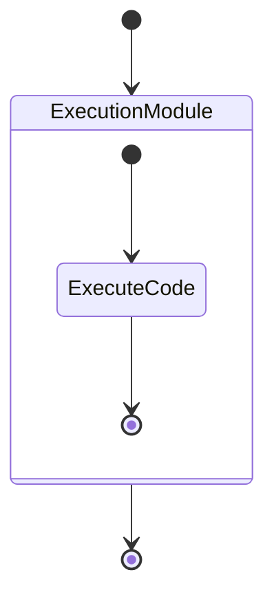
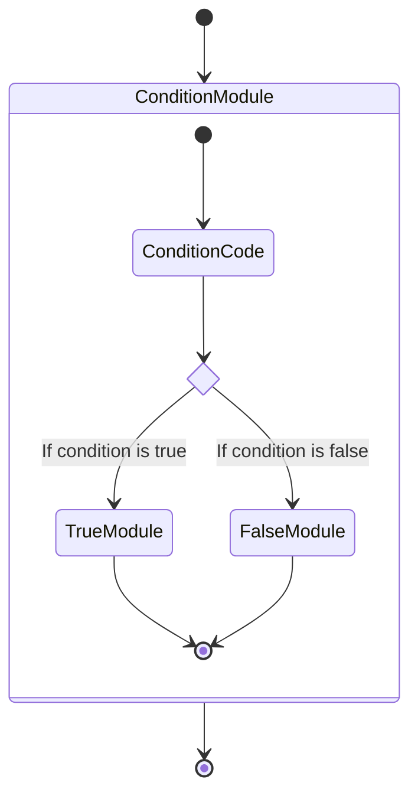
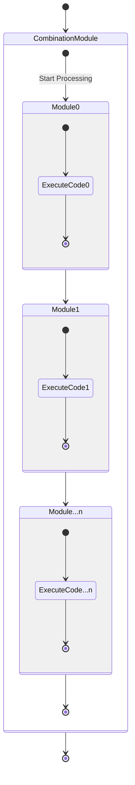
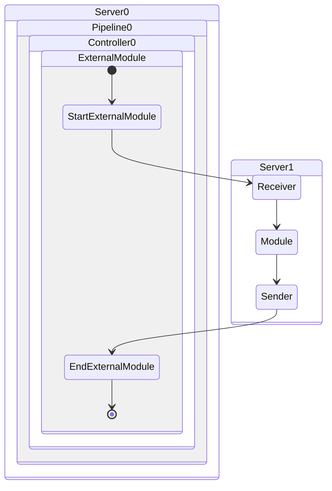
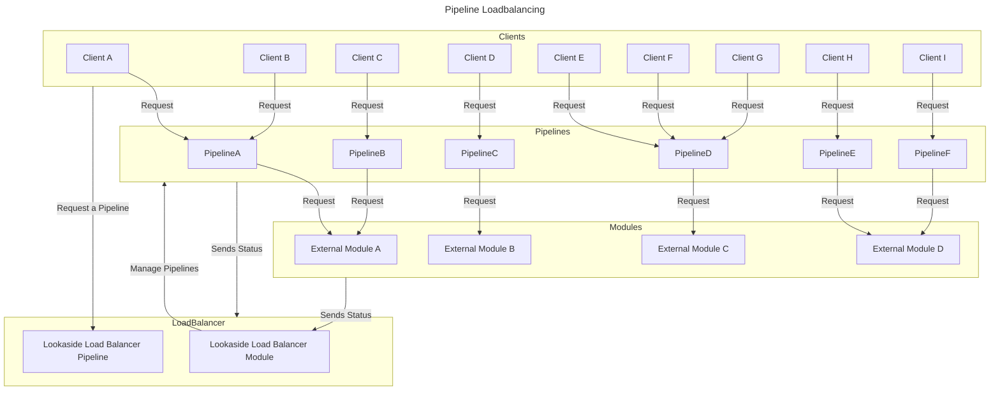

# Pipeline

```mermaid
stateDiagram-v2
    [*] --> Pipeline: Start

    state Pipeline {

        [*] --> Controller0_NOT_PARALLEL

        state Controller0_NOT_PARALLEL {

            [*] --> Phase0_C0

            state Phase0_C0 {
                [*] --> Module0_P0_C0: Start Phase0
                Module0_P0_C0 --> Module1_P0_C0
                Module1_P0_C0 --> Module...n_P0_C0
                Module...n_P0_C0 --> [*]: End Phase0
            }

            Phase0_C0 --> Phase1_C0

            state Phase1_C0 {
                [*] --> Module0_P1_C0: Start Phase1
                Module0_P1_C0 --> Module1_P1_C0
                Module1_P1_C0 --> Module...n_P1_C0
                Module...n_P1_C0 --> [*]: End Phase1
            }

            Phase1_C0 --> Phase...n_C0

            state Phase...n_C0 {
                [*] --> Module0_P...n_C0: Start Phase...n
                Module0_P...n_C0 --> Module1_P...n_C0
                Module1_P...n_C0 --> Module...n_P...n_C0
                Module...n_P...n_C0 --> [*]: End Phase...n
            }

            Phase...n_C0 --> [*]
        }

        Controller0_NOT_PARALLEL --> Controller1_NO_ORDER

        state Controller1_NO_ORDER {

            state fork_state_C0 <<fork>>
            [*] --> fork_state_C0
            fork_state_C0 --> Phase0_C1: 0
            fork_state_C0 --> Phase0_C1: 1
            fork_state_C0 --> Phase0_C1: ...n

            state Phase0_C1 {
                [*] --> Module0_P0_C1: Start Phase0
                Module0_P0_C1 --> Module1_P0_C1
                Module1_P0_C1 --> Module...n_P0_C1
                Module...n_P0_C1 --> [*]: End Phase0
            }

            Phase0_C1 --> Phase1_C1: 0
            Phase0_C1 --> Phase1_C1: 1
            Phase0_C1 --> Phase1_C1: ...n

            state Phase1_C1 {
                [*] --> Module0_P1_C1: Start Phase1
                Module0_P1_C1 --> Module1_P1_C1
                Module1_P1_C1 --> Module...n_P1_C1
                Module...n_P1_C1 --> [*]: End Phase1
            }

            Phase1_C1 --> Phase...n_C1: 0
            Phase1_C1 --> Phase...n_C1: 1
            Phase1_C1 --> Phase...n_C1: ...n

            state Phase...n_C1 {
                [*] --> Module0_P...n_C1: Start Phase...n
                Module0_P...n_C1 --> Module1_P...n_C1
                Module1_P...n_C1 --> Module...n_P...n_C1
                Module...n_P...n_C1 --> [*]: End Phase...n
            }

            state join_state_C0 <<join>>
            Phase...n_C1 --> join_state_C0: 0
            Phase...n_C1 --> join_state_C0: 1
            Phase...n_C1 --> join_state_C0: ...n
            join_state_C0 --> [*]
        }

        Controller1_NO_ORDER --> Controller2_ORDER_BY_SEQUENCE

        state Controller2_ORDER_BY_SEQUENCE {

            [*] --> Add_Sequence_Number_C2

            state fork_state_C1 <<fork>>
            Add_Sequence_Number_C2 --> fork_state_C1
            fork_state_C1 --> Phase0_C2: 0
            fork_state_C1 --> Phase0_C2: 1
            fork_state_C1 --> Phase0_C2: ...n

            state Phase0_C2 {
                [*] --> Module0_P0_C2: Start Phase0
                Module0_P0_C2 --> Module1_P0_C2
                Module1_P0_C2 --> Module...n_P0_C2
                Module...n_P0_C2 --> [*]: End Phase0
            }

            Phase0_C2 --> Phase1_C2: 0
            Phase0_C2 --> Phase1_C2: 1
            Phase0_C2 --> Phase1_C2: ...n

            state Phase1_C2 {
                [*] --> Module0_P1_C2: Start Phase1
                Module0_P1_C2 --> Module1_P1_C2
                Module1_P1_C2 --> Module...n_P1_C2
                Module...n_P1_C2 --> [*]: End Phase1
            }

            Phase1_C2 --> Phase...n_C2: 0
            Phase1_C2 --> Phase...n_C2: 1
            Phase1_C2 --> Phase...n_C2: ...n

            state Phase...n_C2 {
                [*] --> Module0_P...n_C2: Start Phase...n
                Module0_P...n_C2 --> Module1_P...n_C2
                Module1_P...n_C2 --> Module...n_P...n_C2
                Module...n_P...n_C2 --> [*]: End Phase...n
            }

            state join_state_C1 <<join>>
            Phase...n_C2 --> join_state_C1: 0
            Phase...n_C2 --> join_state_C1: 1
            Phase...n_C2 --> join_state_C1: ...n
            join_state_C1 --> Order_By_Sequence_Number_C2
            Order_By_Sequence_Number_C2 --> [*]
        }

        Controller2_ORDER_BY_SEQUENCE --> Controller3_FIRST_WINS

        state Controller3_FIRST_WINS {

            [*] --> Add_Sequence_Number_C3

            state fork_state_C3 <<fork>>
            Add_Sequence_Number_C3 --> fork_state_C3
            fork_state_C3 --> Phase0_C3: 0
            fork_state_C3 --> Phase0_C3: 1
            fork_state_C3 --> Phase0_C3: ...n

            state Phase0_C3 {
                [*] --> Module0_P0_C3: Start Phase0
                Module0_P0_C3 --> Module1_P0_C3
                Module1_P0_C3 --> Module...n_P0_C3
                Module...n_P0_C3 --> [*]: End Phase0
            }

            Phase0_C3 --> Phase1_C3: 0
            Phase0_C3 --> Phase1_C3: 1
            Phase0_C3 --> Phase1_C3: ...n

            state Phase1_C3 {
                [*] --> Module0_P1_C3: Start Phase1
                Module0_P1_C3 --> Module1_P1_C3
                Module1_P1_C3 --> Module...n_P1_C3
                Module...n_P1_C3 --> [*]: End Phase1
            }

            Phase1_C3 --> Phase...n_C3: 0
            Phase1_C3 --> Phase...n_C3: 1
            Phase1_C3 --> Phase...n_C3: ...n

            state Phase...n_C3 {
                [*] --> Module0_P...n_C3: Start Phase...n
                Module0_P...n_C3 --> Module1_P...n_C3
                Module1_P...n_C3 --> Module...n_P...n_C3
                Module...n_P...n_C3 --> [*]: End Phase...n
            }

            state join_state_C2 <<join>>
            Phase...n_C3 --> join_state_C2: 0
            Phase...n_C3 --> join_state_C2: 1
            Phase...n_C3 --> join_state_C2: ...n
            join_state_C2 --> Remove_Older_Then_Last_Sequence_Number_C3

            Remove_Older_Then_Last_Sequence_Number_C3 --> [*]
        }

    }

    Pipeline --> [*]: End


```

# Modules
## ExecutionModule

```mermaid
stateDiagram-v2
    [*] --> ExecutionModule

    state ExecutionModule {
        [*] --> ExecuteCode
        ExecuteCode --> [*]
    }

    ExecutionModule --> [*]
```

## ConditionModule

```mermaid
stateDiagram-v2
    [*] --> ConditionModule


    state ConditionModule {
        state if_state <<choice>>
        [*] --> ConditionCode
        ConditionCode --> if_state
        if_state --> TrueModule: If condition is true
        if_state --> FalseModule : If condition is false

        TrueModule --> [*]
        FalseModule --> [*]
    }

    ConditionModule --> [*]
```

## CombinationModule

```mermaid
stateDiagram-v2
    [*] --> CombinationModule

    state CombinationModule {
        [*] --> Module0: Start Processing

        state Module0 {
            [*] --> ExecuteCode0
            ExecuteCode0 --> [*]
        }

        Module0 --> Module1

        state Module1 {
            [*] --> ExecuteCode1
            ExecuteCode1 --> [*]
        }

        Module1 --> Module...n

        state Module...n {
            [*] --> ExecuteCode...n
            ExecuteCode...n --> [*]
        }

        Module...n --> [*]
    }

    CombinationModule --> [*]
```

## ExternalModule

```mermaid
stateDiagram-v2
    state Server0 {
        state Pipeline0 {
            state Controller0 {
                state ExternalModule {
                    [*] --> StartExternalModule
                    EndExternalModule --> [*]
                }
            }
        }
    }

    state Server1 {

        Receiver --> Module

        Module --> Sender
    }

    StartExternalModule --> Receiver
    Sender --> EndExternalModule
```

# Scaling the Pipline
## Look Aside Loadbalancer

```mermaid
---
title: Pipeline Loadbalancing
---

flowchart TD
    subgraph Clients
        direction RL
        ClientA[Client A]
        ClientB[Client B]
        ClientC[Client C]
        ClientD[Client D]
        ClientE[Client E]
        ClientF[Client F]
        ClientG[Client G]
        ClientH[Client H]
        ClientI[Client I]
    end

    ClientA -->|Request| PipelineA
    ClientB -->|Request| PipelineA
    ClientC -->|Request| PipelineB
    ClientD -->|Request| PipelineC
    ClientE -->|Request| PipelineD
    ClientF -->|Request| PipelineD
    ClientG -->|Request| PipelineD
    ClientH -->|Request| PipelineE
    ClientI -->|Request| PipelineF


    subgraph LoadBalancer
        direction LR
        LLBM[Lookaside Load Balancer Module]
        LLBP[Lookaside Load Balancer Pipeline]
    end


    Clients --> | Request a Pipeline | LLBP
    LLBM --> |Manage Pipelines| Pipelines

    Pipelines --> | Sends Status | LoadBalancer
    Modules -->|Sends Status| LLBM


    subgraph Modules
        direction RL
        ExternalModuleA[External Module A]
        ExternalModuleB[External Module B]
        ExternalModuleC[External Module C]
        ExternalModuleD[External Module D]
    end

    subgraph Pipelines
        direction RL
        PipelineA -->|Request| ExternalModuleA
        PipelineB -->|Request| ExternalModuleA
        PipelineC -->|Request| ExternalModuleB
        PipelineD -->|Request| ExternalModuleC
        PipelineE -->|Request| ExternalModuleD
        PipelineF -->|Request| ExternalModuleD
    end
```