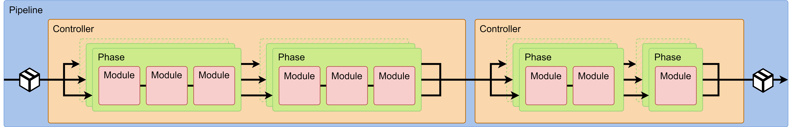
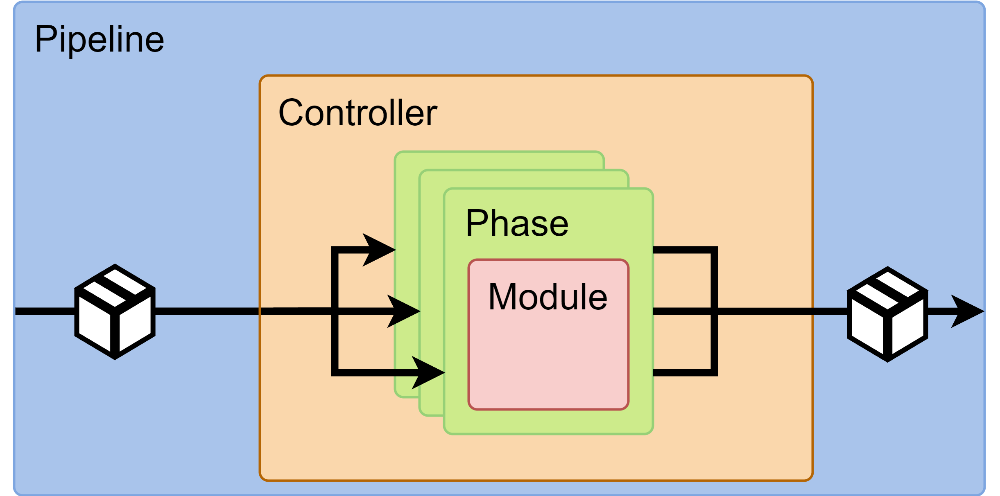
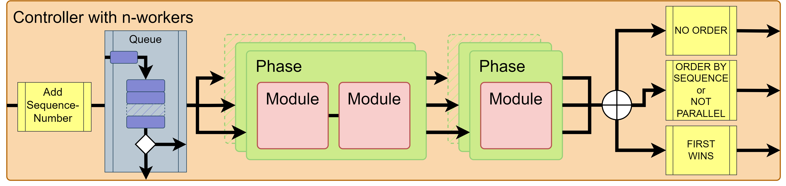
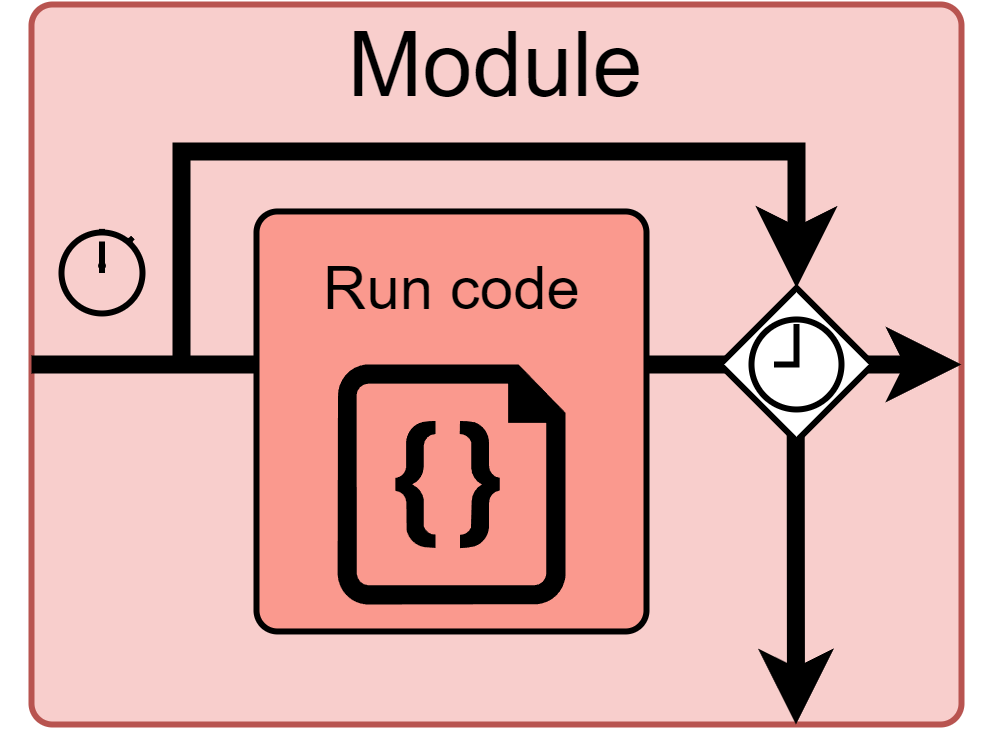
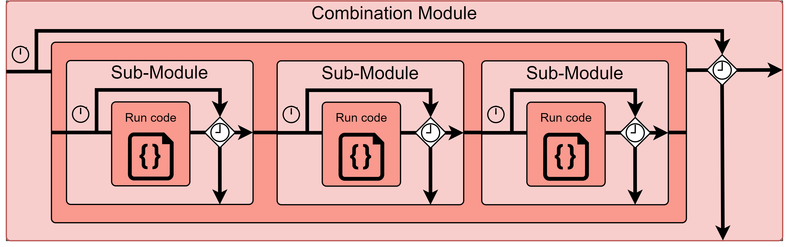
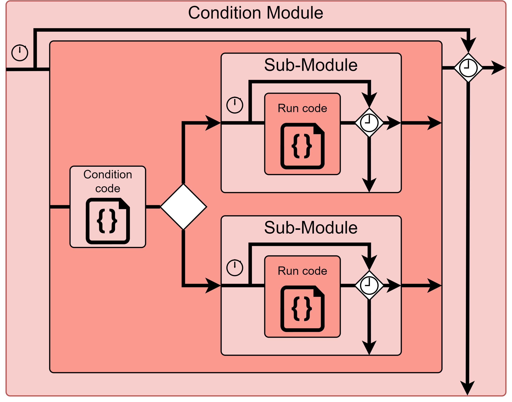
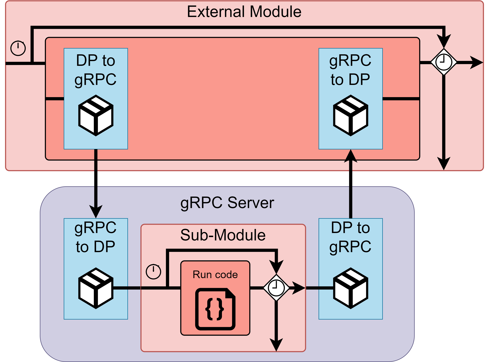

# Pipeline-Framework

For the development of a processing a stream of live data (like live audio transcription system), it is necessary to have a modular system capable of performing real-time measurements at each individual processing step. Additionally, the control of the flow rate, i.e., how much data is processed per second, is of great importance. Another requirement is the ability to scale the system both vertically and horizontally.

To meet these requirements, a pipeline framework was developed, specialized in processing real-time data streams, in this case, audio streams. The pipeline is modular and can be adapted depending on conditions. The source code for the pipeline framework is available at the following link: [stream_pipeline GitHub](https://github.com/JulianKropp/stream_pipeline).

---

## Pipeline Overview


*Figure: Architecture of the developed pipeline, consisting of controllers, phases, and modules.*

The pipeline is divided into several parts, known as elements, as shown in the figure above. A pipeline (light blue box) consists of several controllers (yellow box). A controller is responsible for managing the data flow within the pipeline. It controls the number of incoming data, ensures the pipeline doesn't overload, and can execute phases in parallel. Additionally, it controls the order of data packets. The controller is described in more detail in the section [Controller](#controller).

Inside a controller are phases (green box). A phase serves to group multiple modules, providing better clarity over individual modules. All phases within a controller can operate in parallel, which is controlled by the controller. A phase consists of several modules (red box).

A module is a single processing step performed in the pipeline, where the stream data is processed. In addition to standard modules that simplify development, custom modules can be developed. A module can invoke another module, which is then referred to as a sub-module. Modules are further discussed in the section [Module](#module).

When stream data enters, it is packaged into a data packet that then passes through the pipeline step by step. At each step, the actual data is processed, and information such as runtime, waiting time, or any errors encountered are added to the data packet. It is possible to individually inspect each data packet and track its journey through the pipeline. This allows for detailed analysis and rapid error identification. Additionally, the stable operation of the pipeline is ensured. The data packet is described in the section [Datapackage](#datapackage).

The data entering the pipeline exits as a data packet containing the processed data. This data packet can exit the pipeline in five different ways, with the status being set to `SUCCESS`, `EXIT`, `ERROR`, `OVERFLOW`, or `OUTDATED`. These exits are explained in more detail in the section [Callbacks](#callbacks).

The pipeline allows for measurements to be conducted at each element, determining which elements or modules are the most effective. These measurements are provided via Prometheus and added to the data packet as it passes through the pipeline (see the section [Measurements](#measurements)).

Additionally, a custom error-handling system was implemented to ensure the stability of the pipeline and allow for quick error identification (see the section [Error-Handling](#error-handling)).

The following sections provide a detailed look at the individual elements of the pipeline, moving through the pipeline from start to finish and examining the components that make it up.

---

## Datapackage

  
*Figure: Pipeline that processed the example data package.*

A datapackage (DataPackage) is an object that contains the data of a stream along with metadata about the processing steps in the pipeline. The following example shows such a datapackage in JSON format, and in the figure above, the pipeline that processed the datapackage is shown.

```json
{
    "id": "DP-175762fd-...",
    "pipeline_id": "P-20b3e9da-...",
    "pipeline_name": "test-pipeline",
    "pipeline_instance_id": "PI-99cb7aa6-...",
    "controllers": [
        {
            "id": "DP-C-d4110450-...",
            "controller_id": "C-1b447211-...",
            "controller_name": "controller1",
            "mode": "ORDER_BY_SEQUENCE",
            "workers": "3",
            "sequence_number": "9",
            "status": "Status.SUCCESS",
            "start_time": "1724423573.4358735",
            "end_time": "1724423579.4404526",
            "input_waiting_time": "0.0004448890686035156",
            "output_waiting_time": "4.001535654067993",
            "total_time": "6.004625082015991",
            "phases": [
                {
                "id": "DP-PP-6382e249-...",
                "phase_id": "PP-936f4eed-...",
                "phase_name": "c1-phase1",
                "status": "Status.SUCCESS",
                "start_time": "1724423573.4363277",
                "end_time": "1724423575.438862",
                "total_time": "2.0025343894958496",
                "modules": [
                    {
                        "id": "DP-M-f91a3842-...",
                        "module_id": "M-Transformation-91b26ae9-...",
                        "module_name": "M-Transformation",
                        "status": "Status.SUCCESS",
                        "start_time": "1724423573.436389",
                        "end_time": "1724423575.438758",
                        "waiting_time": "0.0",
                        "total_time": "2.002368927001953",
                        "sub_modules": [],
                        "message": "Transformation succeeded",
                        "error": "None"
                    }
                ]
                }
            ]
        }
    ],
    "data": "VALUE9",
    "status": "Status.SUCCESS",
    "start_time": "1724423573.4358275",
    "end_time": "1724423579.4405026",
    "total_time": "6.0046751499176025",
    "errors": []
}
```

The JSON datapackage describes the journey through the pipeline and contains both the actual data and metadata about individual elements. Many of these fields follow a recurring schema applicable to different elements of the pipeline, such as controllers, phases, and modules. Below are the common keys and their meanings:

- **id**: A unique identifier for an element in the datapackage. Every element in a datapackage has its own unique ID.
- **...\_id**: The unique identifier of the respective element, such as `controller_id`, `phase_id`, or `module_id`.
- **...\_name**: The name of the respective element, often describing the type of function or processing.
- **status**: The processing status of the respective element, which can have one of the following values:
  - `Status.RUNNING`
  - `Status.WAITING`
  - `Status.SUCCESS`
  - `Status.EXIT`
  - `Status.ERROR`
  - `Status.OVERFLOW`
  - `Status.OUTDATED`
  - `Status.WAITING_OUTPUT`
  
  If, for example, a module fails with an error, the status `Status.ERROR` will be set in the module, as well as in the corresponding phase, controller, and pipeline of the datapackage.
- **start_time** and **end_time**: Timestamps marking the start and end of processing for the respective element.
- **input_waiting_time**, **output_waiting_time**, **waiting_time**: Waiting times before processing starts and until the datapackage is output. These times are used by the controller and module.
- **total_time**: The total time taken for the element to complete its processing. It is calculated as follows:  
    $$
    \text{total\_time} = \text{end\_time} - \text{start\_time}
    $$

    $$
    \text{total\_time} = \text{processing\_time} + \text{waiting\_time}
    $$

    Since the `processing_time` is not explicitly included in the datapackage, it can be calculated as follows:

    $$
    \text{processing\_time} = \text{total\_time} - \text{waiting\_time}
    $$

    $$
    \text{processing\_time} = \text{total\_time} - \text{input\_waiting\_time} - \text{output\_waiting\_time}
    $$


In addition to these general pieces of information, there are specific details for the individual elements of the pipeline:

- **Pipeline Information:**
  - **controller**: A list of controllers included in this pipeline.
  - **data**: The actual data being transported by the datapackage.
  - **errors**: A complete list of errors encountered during processing.

- **Controller:**
  - **mode**: The mode of the controller, which indicates how the data is output at the end of the controller. This can be:
    - `NOT_PARALLEL`
    - `NO_ORDER`
    - `ORDER_BY_SEQUENCE`
    - `FIRST_WINS`
  - **workers**: The number of worker processes running in parallel to execute the phases.
  - **sequence_number**: The sequence number of the datapackage during processing.

- **Phases:**
  - **modules**: A list of modules executed in this phase.

- **Module:**
  - **sub_modules**: A list of sub-modules invoked within the module. A sub-module is another module called by the current module.
  - **message**: An optional message added by the module's developer to describe the processing.
  - **error**: Errors encountered during the module's processing.

---

## Callbacks

As explained in the section [Datapackage](#datapackage), it is possible to track exactly how a datapackage passed through the pipeline. In some cases, individual elements may decide that the datapackage should exit the pipeline early. For this purpose, various callbacks and corresponding status values are set in the datapackage. These callbacks include:

- **callback**: Executed when the datapackage has successfully passed through the pipeline. The status of the datapackage is set to `SUCCESS`.
- **exit_callback**: Executed when the datapackage leaves the pipeline early because it was sorted out by a module. No error occurs in this case. The status of the module, phase, controller, and datapackage is set to `EXIT`.
- **overflow_callback**: Executed when the datapackage leaves the pipeline to avoid an overload. The status of the controller and the datapackage is set to `OVERFLOW`.
- **outdated_callback**: Executed when the datapackage leaves the pipeline because it was "overtaken" by a newer datapackage. This is decided by the controller’s mode (see the section [Controller](#controller)). The status of the controller and the datapackage is set to `OUTDATED`.
- **error_callback**: Executed when the datapackage leaves the pipeline due to an error. The status of the datapackage is set to `ERROR`.

The status is passed up to the parent element, and thus the status is set for the entire datapackage. For instance, the module’s status is passed to the phase, the phase’s status to the controller, and the controller’s status to the datapackage. This allows for quick identification of where the datapackage exited the pipeline.

At these points, the flow rate of outgoing datapackages is also measured, as described in the section [Measurements](#measurements).

---

## Controller

  
*Figure: Architecture of the controller.*

The pipeline contains one or more controllers. The controller is responsible for managing the data flow within the pipeline. It uses the datapackage, into which it inserts information about itself and a sequence number at the beginning. This is represented by the pink box at the start of the controller in the figure above. The sequence number becomes important at the end of the controller to sort the datapackage according to the mode in which the controller is operating.

Next, there is a queue, shown as the purple box in the figure above. This ensures that the pipeline does not become overloaded. The queue size can be set using the parameter `queue_size`. By default, it is as large as the number of workers executing the phases in parallel. When datapackages arrive, they are placed in the queue. As soon as a worker is available, it takes a datapackage from the queue and processes the phases sequentially. If the queue is full, the oldest datapackage is removed via the overflow callback, exiting the pipeline. The overflow callback is executed when a datapackage reaches a full queue in a controller. This ensures that outdated data does not remain in the pipeline and prevents overloading.

The controller receives the parameter `max_workers`, which specifies the number of workers that execute the phases in parallel. In the figure above, these are represented by the stacked green boxes. This is useful for vertically scaling the pipeline. Each worker processes the phases in the specified order. However, one worker may be faster than another, so at the end, a decision must be made about the order in which the datapackages leave the controller. The sequence number set at the beginning is used to make this decision. The controller can output datapackages in four ways, referred to as the controller’s modes:

- **NOT_PARALLEL**: The datapackages are processed in the order they entered the controller. The number of `max_workers` is set to 1, meaning no parallel processing occurs, and the order of datapackages is preserved.
- **NO_ORDER**: The datapackages are handed to the workers in the order they entered the controller. A worker may finish processing faster than another. At the end, no sorting is done, and the datapackages exit the controller in the order they were processed.  
  Example: Entry order: [1, 2, 3, 4, 5]. Processing order: [1, 3, 2, 5, 4]. The datapackages are returned in the order [1, 3, 2, 5, 4].
- **ORDER_BY_SEQUENCE**: The datapackages are handed to the workers in the order they entered the controller. A worker may finish processing faster than another. At the end, the datapackages are sorted by sequence number and exit the controller in the order they entered.  
  Example: Entry order: [1, 2, 3, 4, 5]. Processing order: [1, 3, 2, 5, 4]. The datapackages are returned in the order [1, 2, 3, 4, 5]. Datapackage 3 must wait for the worker processing datapackage 2, and datapackage 5 must wait for the worker processing datapackage 4.
- **FIRST_WINS**: The datapackages are handed to the workers in the order they entered the controller. A worker may finish processing faster than another. Only the newest datapackages are returned at the end, and older datapackages are discarded and exit the pipeline via the `outdated_callback`.  
  Example: Entry order: [1, 2, 3, 4, 5]. Processing order: [1, 3, 2, 5, 4]. The datapackages are returned in the order [1, 3, 5]. Datapackages 2 and 4 exit the pipeline via the `outdated_callback` as they were "overtaken."

---

## Module

  
*Figure: Architecture of a module.*

A module is an element where the stream data from a datapackage is processed. Since the pipeline serves only as a framework and does not implement the actual processing, the developer must implement this part themselves. For this purpose, an abstract class called `Module` is provided, which defines the basic functions of a module and forces the developer to implement the abstract methods `init_module` for initializing the module and `execute` for processing the data.

Additionally, various options are available for the module. The option `use_mutex: bool = False` ensures that the entire module is locked during processing. If other workers invoked by the controller attempt to access this module, they must wait until the module’s processing is complete. The `timeout` option can be used to limit the processing time. This is represented in the figure above by the arrow leading around "Run Code". The code in the `execute` method is started in a new thread. If the time expires before the processing is complete, the thread’s access to the datapackage is blocked. When this thread then attempts to access the datapackage, an error is triggered. This approach is necessary since a running thread cannot simply be terminated. However, this ensures that no data in the datapackage is altered.

A module can be designed to be either `stateful` or `stateless`. If a module is designed as `stateful`, the overlying controller should run in `NOT_PARALLEL` mode. This is necessary to ensure that incoming data is processed in the correct order. Otherwise, the order of incoming data cannot be guaranteed, which would make the implementation of a `stateful` module significantly more difficult.

To simplify development and enable more complex combinations, a module can invoke another module. The invoked module is referred to as a sub-module. It is important to note that a sub-module is a fully functional, independent module. It is only called a sub-module because it is invoked by another module. A sub-module can, in turn, call other modules, which are also considered sub-modules. In the datapackage, a sub-module is listed under `sub_modules` within the module that invoked it. A module can invoke one or more other modules, which can also invoke further modules. This structure increases the flexibility of the pipeline and optimizes data processing, enabling the creation of modules such as the `Combination-Module`, `Condition-Module`, or `External-Module`.

### Combination-Module

  
*Figure: Architecture of a combination module.*

The combination module is a module that unites several modules and can execute them sequentially. In the datapackage, a list of sub-modules that were executed within this module is included under the key `sub_modules` (see the figure above).

### Condition-Module

  
*Figure: Architecture of a condition module.*

The condition module checks a condition. If the condition is met, one module is executed; otherwise, an alternative module is executed. In the datapackage, a list of the modules executed within this condition is stored under the key `sub_modules` (see the figure above). By using such a module, the pipeline can take different paths. It is also possible to invoke a combination module within a condition module, further increasing the flexibility of the processing.

### External-Module

  
*Figure: Architecture of an external module.*

The external module allows a module to be executed on another server. This enables the pipeline to be distributed across multiple servers, thus improving horizontal scalability. Communication is performed using gRPC (see the figure above).


---

## Measurements

During each run of a datapackage through the pipeline, time measurements are conducted at various points. For every element of the pipeline, the status is recorded, and the runtime is measured. Additionally, for controllers and modules, waiting times are captured. As shown in the section [Datapackage](#datapackage), these measurements are progressively added to the datapackage. An overview of the measurements taken for each element can be found in the table below.

| Pipeline  | Controller          | Phase      | Module     |
|-----------|---------------------|------------|------------|
| status    | status               | status     | status     |
| start_time| start_time           | start_time | start_time |
| end_time  | end_time             | end_time   | end_time   |
| total_time| total_time           | total_time | total_time |
|           | input_waiting_time   |            | waiting_time|
|           | output_waiting_time  |            |            |

*Table: Measurement data from the datapackage. See the example in [Datapackage](#datapackage).*

Since individual datapackages do not provide insight into the entire pipeline's performance, measurements are recorded and made available as Prometheus metrics. These metrics include the runtime and waiting time for the pipeline, each controller, phase, and module. Additionally, the flow rate (throughput) is measured for each controller, phase, and module, as well as for the entire pipeline.

Prometheus metrics do not indicate how individual datapackages flowed through the pipeline but represent the average performance of all datapackages that have passed through the pipeline. Therefore, they describe how the pipeline operates as a whole.

In the table below, a list of the measurements recorded for each element is provided:

| Pipeline        | Controller     | Phase         | Module        |
|-----------------|----------------|---------------|---------------|
| input_flowrate  | input_flowrate | input_flowrate| input_flowrate|
| output_flowrate | output_flowrate| output_flowrate| output_flowrate|
| exit_flowrate   | exit_flowrate  | exit_flowrate | exit_flowrate |
| overflow_flowrate| overflow_flowrate|            |               |
| outdated_flowrate| outdated_flowrate|             |               |
| error_flowrate  | error_flowrate | error_flowrate| error_flowrate|
| success_time    | success_time   | success_time  | success_time  |
| exit_time       | exit_time      | exit_time     | exit_time     |
| overflow_time   | overflow_time  |               |               |
| outdated_time   | outdated_time  |               |               |
| error_time      | error_time     | error_time    | error_time    |
|                 | input_waiting_time|            | waiting_time  |
|                 | output_waiting_time|           |               |
| processing_counter| processing_counter| processing_counter| processing_counter|
|                 | input_waiting_counter|         | waiting_counter|
|                 | output_waiting_counter|        |               |

*Table: Prometheus Metrics*

The flow rate is measured at each element in the pipeline and indicates how many datapackages entered the element and how many left it in different ways. Five different types of flow rates are distinguished:

- **Input**: The number of datapackages that entered the controller, measured in datapackages per second.
- **Output**: The number of datapackages that successfully left the controller, measured in datapackages per second.
- **Exit**: The number of datapackages that left the controller without error before completing processing, measured in datapackages per second.
- **Overflow**: The number of datapackages that left the controller to avoid an overload, measured in datapackages per second.
- **Error**: The number of datapackages that left the controller due to an error, measured in datapackages per second.

These measurements are essential as they reveal how many datapackages enter the pipeline and how many exit via various routes. The `input_flowrate` equals the sum of all other flow rates:

\[
\text{input_flowrate} = \text{output_flowrate} + \text{exit_flowrate} + \text{overflow_flowrate} + \text{outdated_flowrate} + \text{error_flowrate}
\]

The `output_flowrate` and `exit_flowrate` should ideally be high, as this indicates that the pipeline is efficiently processing the incoming data, even though not all data is processed successfully. The `output_flowrate` represents the successfully processed data, while the `exit_flowrate` represents controlled removal of datapackages from the pipeline. Reasons for removing datapackages could include erroneous data, adjusting the flow rate, or avoiding unnecessary processing of duplicate data.

The `overflow_flowrate` should be as low as possible, as it suggests that the pipeline is not overloaded. If the pipeline becomes overloaded, two possible solutions exist: expanding capacity through scaling to process more datapackages, or identifying and removing "unnecessary" datapackages through the `exit` output. A combination of both is also possible.

The `outdated_flowrate` should also be kept low, as it indicates an inefficient pipeline. This should be avoided, as it means that data must be discarded as outdated after processing, which wastes resources. Preprocessing in previous modules can help identify data that tends to take longer to process and might be overtaken by newer datapackages. Adjusting the number of workers can also help reduce the outdated flowrate.

The `error_flowrate` should be kept low, as errors during processing suggest that the pipeline is not optimally programmed. When errors occur, these datapackages should be examined individually to identify the causes of the errors during processing. Data that arrives in an erroneous state and cannot be processed by the pipeline should either be modified by a previous module or removed via the `exit_callback` output.

The `success_time`, `exit_time`, `overflow_time`, `outdated_time`, and `error_time` represent how long a datapackage took to be processed. A quick glance at these data points can also reveal if an element is taking too long to process. These measurements capture the total time a datapackage spends in an element, including both waiting and processing time.

In particular, the `waiting_time` of a module or the `input_waiting_time` and `output_waiting_time` of a controller can indicate that while processing is efficient, the waiting time before processing begins is too high. In such cases, the pipeline should be optimized, for example, by adjusting the number of workers or the size of the queue. The larger the queue, the longer data has to wait for processing, and the older the data will be by the time it exits the pipeline.

The `processing_counter`, `input_waiting_counter`, and `output_waiting_counter` indicate how many datapackages are currently waiting or being processed. These metrics, similar to flowrate, are crucial for observing the pipeline's workload in real-time.


---

## Error-Handling

To ensure the stability of the pipeline and to quickly identify errors, a custom error-handling system has been implemented. Errors are stored in the datapackage and can, like the datapackage itself, be output in JSON format. The error is recorded both in the respective module and in the `errors` section of the datapackage. This makes it easy to create a list of all errors that occurred during processing and to quickly associate each error with the corresponding module. It is possible to specify the type of error, determine in which thread the error occurred, and from which thread it was started. A detailed traceback shows the error message as well as the path to the point of failure. This works even if the error occurred in a module on an external server. In such cases, the entire datapackage, including the error, is sent back to the server via gRPC for evaluation.

The level of detail in the error message can be configured. For example, it is possible to display global and local variables that were active at the time of the error, as well as installed Python packages or environment variables. Below is a list of the options available for displaying error messages. Each option can be individually enabled or disabled:

- **id**: The ID of the error.
- **exc_type**: The type of the error.
- **message**: The error message.
- **traceback**: The path to the error.
- **thread**: The thread in which the error occurred.
- **start_context**: The thread that started the thread where the error occurred.
- **thread_id**: The ID of the thread.
- **is_daemon**: Whether the thread is a daemon.
- **local_vars**: The local variables.
- **global_vars**: The global variables.
- **environment_vars**: The environment variables.
- **module_versions**: The installed modules.

When an error occurs, it is inserted into the datapackage, which then exits the pipeline via the `error_callback`. Below is an example of an error that has been added to the datapackage in JSON format. In this example, the options `local_vars`, `global_vars`, `environment_vars`, and `module_versions` have been disabled for simplicity:

```json
"error": {
    "message": "Test Error",
    "id": "Error-a87d08db-...",
    "type": "ValueError",
    "traceback": [
        "Traceback (most recent call last):",
        "/home/user/stream_pipeline/stream_pipeline/module_classes.py:155",
        "/home/user/stream_pipeline/main.py:33",
        "ValueError: Test Error"
    ],
    "thread": "Thread-11 (_execute_with_result)",
    "start_context": "ThreadPoolExecutor-6_2",
    "thread_id": 140713513702976,
    "is_daemon": false
}
```

---